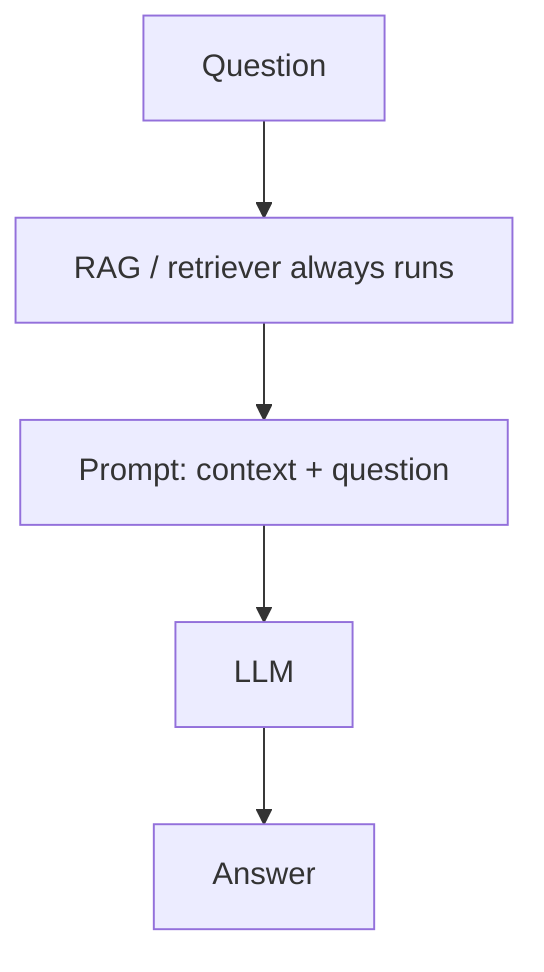
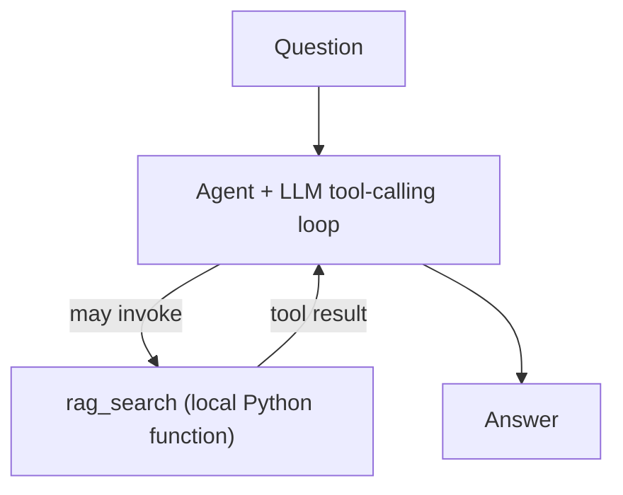
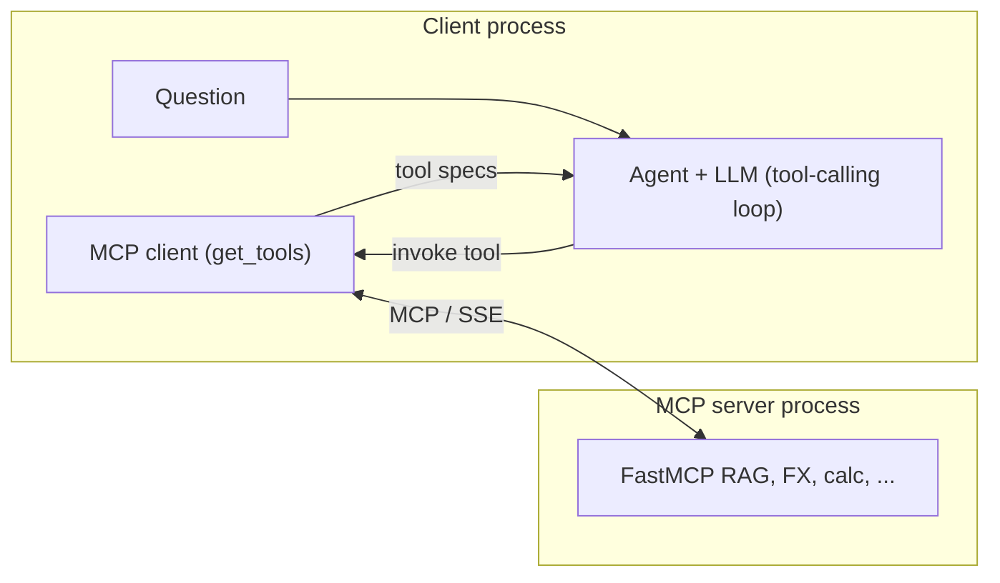

# MCP PoC

Three scenarios that show how tool usage behavior changes depending on architecture.

## The Three Scenarios

### Scenario 1 — Chain (no decision-making)

The RAG tool is hardwired into a LangChain chain. It **always runs**, no matter
what the question is. The LLM receives the retrieved context every time — even
when that context is irrelevant. There is no decision-making: the flow is linear
and deterministic.

**Key insight:** High control, zero flexibility. You decide upfront what runs.

### Scenario 2 — Agent (LLM decides)

A LangGraph agent built with `create_agent` has the RAG tool available but
**decides whether to use it**. Ask a research question → the agent calls RAG.
Ask something general → the agent answers directly without touching the tool.
The LLM controls the flow.

**Key insight:** Flexible, but the LLM is now in charge of deciding when tools help.

### Scenario 3 — MCP Server + Client (tools as a service)

A FastMCP server exposes **3 tools** (RAG search, live exchange rate, calculator)
via the Model Context Protocol. A separate LangGraph agent connects to the server
at runtime and **discovers the tools automatically** — no tool is hardcoded in the
client. The agent follows the same pattern as scenario 2, but its toolbox is
provided by an external server over the network.

**Key insight:** Tools are decoupled from the agent. Any MCP-compatible client
can connect and use the same server. The agent doesn't know what tools exist
until it connects.

---

## Execution model: how the three scenarios differ

The same high-level goal (answer questions with optional retrieval) is wired
three different ways. These diagrams focus on **where control lives** and **how
tools are bound** — not on MLflow or CLI details.

### Scenario 1 — Chain (fixed pipeline)

The retriever is part of the graph **before** the LLM. There is no loop and no
tool abstraction: retrieval is not “optional,” it is **always** the first step.




### Scenario 2 — Agent + in-process tool

The LLM sits inside an **agent** that can **choose** to call `rag_search`. The
tool is a **normal Python function** in the same process as the agent; nothing
is discovered at runtime over the network.




### Scenario 3 — MCP server (tools as a remote service)

A **separate process** exposes tools via the Model Context Protocol. The client
**connects**, **lists tools**, then builds the agent with that list. Tool
execution crosses the process boundary (e.g. SSE) to the server.




**Summary**


|                              | Scenario 1                  | Scenario 2                          | Scenario 3                                |
| ---------------------------- | --------------------------- | ----------------------------------- | ----------------------------------------- |
| **Who decides if RAG runs?** | Nobody — it always runs     | The LLM (via the agent)             | The LLM (via the agent)                   |
| **Where do tools live?**     | Not tools — wired retriever | In-process Python callables         | Remote server; client discovers them      |
| **Typical use**              | Predictable ETL-style flows | Flexible reasoning with local tools | Shareable, versioned tools across clients |


---

## Setup

### Prerequisites

- Python 3.13+
- [uv](https://docs.astral.sh/uv/) package manager
- OpenAI API key

### Install

```bash
uv sync
```

### Configure

```bash
cp .env.example .env
# Edit .env and add your OPENAI_API_KEY
```

### Ingest arXiv papers (run once)

```bash
uv run python shared/ingest_arxiv.py
```

This downloads 5 arXiv abstracts about LLM agents and stores them in ChromaDB locally.

---

## Running the Scenarios

### Scenario 1 — Chain

```bash
uv run python scenario_1_chain/main.py
```

### Scenario 2 — Agent

```bash
uv run python scenario_2_agent/main.py
```

### Scenario 3 — MCP Server + Client

Open **two terminals**:

**Terminal 1 — start the server:**

```bash
uv run python scenario_3_mcp/server.py
```

**Terminal 2 — run the client:**

```bash
uv run python scenario_3_mcp/client.py
```

---

## Viewing Traces in MLflow

Start the MLflow UI:

```bash
mlflow ui
```

Open [http://localhost:5000](http://localhost:5000) in your browser.

Each scenario has its own experiment (`scenario_1_chain`, `scenario_2_agent`,
`scenario_3_mcp`). Click into a run to see which nodes executed, which tools were
called, the LLM input/output, and latency.

**What to look for:**

- Scenario 1: RAG always appears in the trace
- Scenario 2: RAG appears only for research questions, not for simple ones
- Scenario 3: Three different tools appear across three different runs

